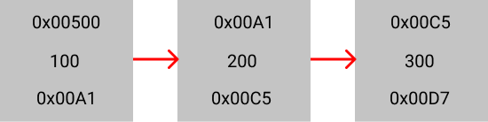
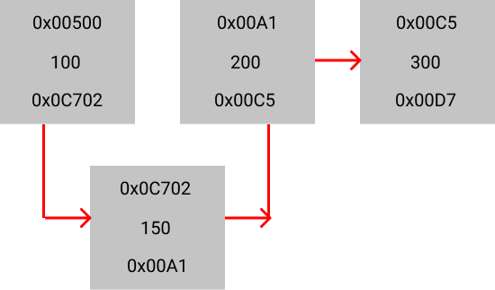

# Linked List

Linked list is a linear data structure that store data in random memory locations. Each of these locations are connected to each other by the memory address of the previous address pointing out to the memory address of the next value. The first value in the linked list is called the head and the last value is called the tail. The head and the tail are not stored in the memory. They are only used to point to the first and the last value in the linked list.

# Representation of a node in a linked list:


In the above diagram, the topmost address is the current memory address, the middle is the value or the element stored in the current address and the bottom is the memory address of the next value or the next node.

# Internal representation of a linked list:



# Inserting a node in a linked list:



# Complexity of insertion / deletion:

Complexity of inserting / deleting a node in a linked list is O(n) where n is the number of nodes in the linked list.

Complextiy of traversing a linked list is O(n) where n is the number of nodes in the linked list.

## Benefits of linked list

Two main benefits of linked list are:

- Preallocation of memory is not required.
- Insertion and deletion is faster and easier

# Implementation of a linked list in Python is shown below:

```python
def foo() :
    # Node class
    class Node :
        def __init__ (self, data = None, next = None) :
            self.data = data
            self.next = next
    # Linked List class
    class LinkedList :
        def __init__ (self) :
            self.head = None
        # Inserting a Node at the beginning of the linked list
        def insert_at_beginning (self, data) :
            node = Node(data, self.head)
            self.head = node
        # Printing the entire linked list
        def print(self) :
            if self.head is None :
                print("Linked List is empty")
                return
            iteration = self.head
            llstr = ''
            while iteration :
                llstr += " -> " + str(iteration.data)
                iteration = iteration.next
            print(llstr)
        # Inserting a node at the end of the linked list
        def insert_at_end (self, data) :
            if self.head is None :
                self.head = Node(data, None)
                return
            iteration = self.head
            while iteration.next :
                iteration = iteration.next
            iteration.next = Node(data, None)
        # Create a seperate linked list and insert at end
        def create(self, arr) :
            for data in arr :
                self.insert_at_end(data)
        # Removing an item from the given index from a linked list
        def remove(self, index) :
            count = 0
            iteration = self.head
            while iteration :
                if count == index - 1 :
                    iteration.next = iteration.next.next
                    break
                iteration = iteration.next
                count += 1
        # Adding an item at the given index to a linked list
        def insert(self, index, data) :
            if index == 0 :
                self.insert_at_beginning(data)
                return
            count = 0
            iteration = self.head
            while iteration :
                if count == index - 1 :
                    node = Node(data, iteration.next)
                    iteration.next = node
                    break
                iteration = iteration.next
                count += 1

    ll = LinkedList()
    ll.insert_at_beginning(1)
    ll.insert_at_beginning(2)
    ll.insert_at_beginning(3)
    ll.insert_at_end(4)
    ll.insert_at_end(5)
    ll.create([6,7,8])
    ll.print()
    print("After removing")
    ll.remove(4)
    ll.print()
    print("After adding")
    ll.insert(2,9)
    ll.print()

if __name__ == '__main__' :
    foo()
```
